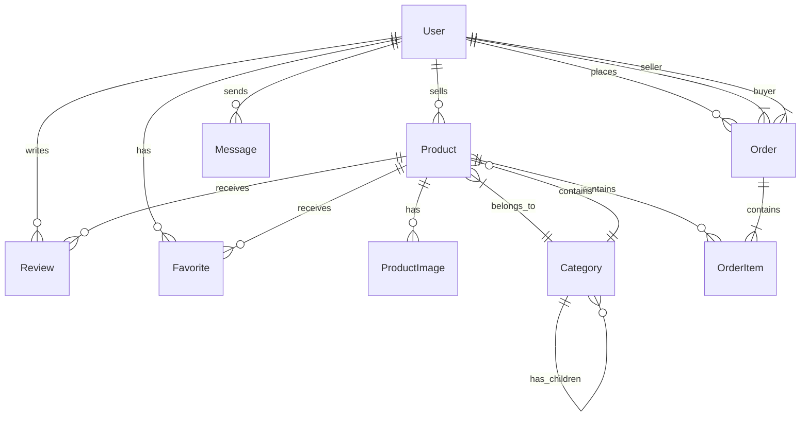

# Architecture Documentation

## 🏛️ System Architecture

### High-Level Overview

```
┌─────────────────────────────────────────────────────────────┐
│                         Users                                 │
└─────────────┬───────────────────────┬───────────────────────┘
              │                       │
              ▼                       ▼
┌─────────────────────┐ ┌─────────────────────┐
│   Web App (Public)  │ │  App (Dashboard)    │
│  threadly.com       │ │  app.threadly.com   │
│                     │ │                     │
│ • Browse Products   │ │ • Manage Listings   │
│ • Search & Filter   │ │ • Process Orders    │
│ • View Details      │ │ • Send Messages     │
│ • Add to Cart       │ │ • View Analytics    │
└──────────┬──────────┘ └──────────┬──────────┘
           │                       │
           ▼                       ▼
┌─────────────────────────────────────────────┐
│              API Gateway                     │
│           api.threadly.com                   │
│                                              │
│  • REST APIs      • Webhooks                │
│  • Auth Checks    • Rate Limiting           │
│  • Validation     • Error Handling          │
└──────────┬──────────────────────────────────┘
           │
           ▼
┌─────────────────────────────────────────────┐
│           Shared Services                    │
├─────────────────┬─────────────────┬─────────┤
│   PostgreSQL    │     Redis       │  S3/CDN │
│   Database      │     Cache       │  Storage│
└─────────────────┴─────────────────┴─────────┘
```

### Monorepo Structure

```
threadly/
├── apps/
│   ├── web/          # Public marketplace
│   ├── app/          # User dashboard
│   └── api/          # Backend services
├── packages/
│   ├── database/     # Prisma ORM & schemas
│   ├── ui/           # Shared components
│   ├── auth/         # Authentication logic
│   ├── payments/     # Payment processing
│   └── utils/        # Shared utilities
└── documentation/    # Project docs
```

## 🗄️ Database Design

### Core Entities



### Key Relationships

1. **Users**: Central entity linking to all activities
2. **Products**: Core marketplace item with images, categories
3. **Orders**: Tracks transactions between buyers and sellers
4. **Messages**: Enables buyer-seller communication
5. **Reviews**: Builds trust and reputation

## 🔐 Authentication Flow

### User Journey

```
1. User visits threadly.com
   └─→ Can browse without auth
   
2. User clicks "Sign In" or protected action
   └─→ Redirected to app.threadly.com/sign-in
   
3. Clerk handles authentication
   └─→ Creates/updates user in our database
   
4. User authenticated
   └─→ Can access dashboard, create listings, buy items
```

### Implementation

- **Public Routes** (web app): No authentication required
- **Protected Routes** (app): Clerk middleware enforces auth
- **API Routes**: Verify Clerk session tokens
- **Webhooks**: Sync Clerk events to our database

## 🛒 Data Flow Examples

### Product Creation

```
1. Seller fills form in app
   ↓
2. Images uploaded to UploadThing
   ↓
3. Form submitted to server action
   ↓
4. Server validates data & auth
   ↓
5. Product created in database
   ↓
6. Search index updated
   ↓
7. Success response to client
```

### Purchase Flow

```
1. Buyer adds items to cart (localStorage)
   ↓
2. Proceeds to checkout
   ↓
3. Stripe Payment Intent created
   ↓
4. Payment processed
   ↓
5. Webhook received from Stripe
   ↓
6. Order created in database
   ↓
7. Email notifications sent
   ↓
8. Seller notified of sale
```

## 🚀 Performance Strategies

### Caching Layers

1. **Browser Cache**: Static assets, images
2. **CDN Cache**: Product images, static files
3. **Redis Cache**: API responses, session data
4. **Database Cache**: Query results
5. **React Query**: Client-side data cache

### Optimization Techniques

- **Server Components**: Default for better performance
- **Dynamic Imports**: Code splitting for large components
- **Image Optimization**: Next.js Image with responsive sizes
- **Database Indexes**: On frequently queried fields
- **Edge Functions**: For lightweight APIs

## 🔧 Technology Decisions

### Why This Stack?

**Next.js 15**: 
- Latest features (App Router, RSC)
- Excellent performance
- Great developer experience

**TypeScript**:
- Type safety across the stack
- Better refactoring
- Self-documenting code

**Prisma**:
- Type-safe database queries
- Excellent DX with migrations
- Works well with TypeScript

**Clerk**:
- Production-ready auth
- Great user management
- Webhook support

**Turborepo**:
- Efficient monorepo builds
- Shared package management
- Parallel execution

### Trade-offs

**Pros**:
- Fast development with modern tools
- Type safety prevents bugs
- Scalable architecture
- Great performance

**Cons**:
- Learning curve for new developers
- More complex than single app
- Higher initial setup time

## 🌐 API Design Principles

### RESTful Conventions

```
GET    /api/products      # List
POST   /api/products      # Create
GET    /api/products/:id  # Read
PUT    /api/products/:id  # Update
DELETE /api/products/:id  # Delete
```

### Response Format

```typescript
// Success
{
  data: T,
  meta?: {
    pagination?: {...}
  }
}

// Error
{
  error: string,
  details?: any
}
```

### Versioning Strategy

- No versioning initially
- When needed: URL versioning (`/api/v2/...`)
- Deprecation notices in headers

## 🔒 Security Architecture

### Defense in Depth

1. **Network**: Cloudflare WAF, DDoS protection
2. **Application**: Input validation, CSRF tokens
3. **Authentication**: Clerk with secure sessions
4. **Authorization**: Role-based access control
5. **Data**: Encryption at rest and in transit

### Security Measures

- **Input Validation**: Zod schemas on all inputs
- **SQL Injection**: Prisma prevents by design
- **XSS Prevention**: React escapes by default
- **CSRF Protection**: Built into Next.js
- **Rate Limiting**: API endpoint protection
- **Secrets Management**: Environment variables

## 📈 Scalability Plan

### Vertical Scaling

1. Upgrade database tier
2. Increase Vercel limits
3. Add more memory to functions

### Horizontal Scaling

1. **Database Read Replicas**: For read-heavy loads
2. **Multi-Region Deployment**: Closer to users
3. **Microservices**: Split into smaller services
4. **Queue System**: For background jobs

### When to Scale

- Response times > 500ms consistently
- Database CPU > 80%
- Error rate > 1%
- User complaints about speed

## 🔄 State Management

### Client State

- **Zustand**: Cart, UI preferences
- **React Query**: Server data cache
- **Context**: Theme, user preferences
- **Local Storage**: Persistent client data

### Server State

- **Database**: Source of truth
- **Redis**: Temporary data, sessions
- **Cookies**: Auth tokens, preferences

### Real-time State

- **WebSockets**: Live messaging
- **Server-Sent Events**: Notifications
- **Polling**: Fallback for simple updates

## 🎯 Future Considerations

### Potential Improvements

1. **GraphQL API**: For mobile app
2. **Event Sourcing**: For order history
3. **CQRS**: Separate read/write models
4. **Microservices**: As we scale
5. **Native Apps**: iOS/Android

### Technical Debt

- Refactor hardcoded category IDs
- Improve error handling consistency
- Add comprehensive logging
- Increase test coverage
- Document internal APIs better