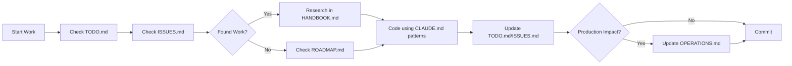

# 🧠 CLAUDE.md - Operational Brain

*Critical information for working with Threadly codebase*

**Last Updated**: January 10, 2025

## 🎯 PROJECT CONTEXT
**Threadly** = Premium C2C fashion marketplace (Vinted competitor)
- **Tech Stack**: Next.js 15, TypeScript, Turborepo, Prisma, Stripe
- **Architecture**: 3 apps (/web = public, /app = dashboard, /api = backend)
- **Status**: 100% MVP complete, production ready

## ⚡ QUICK COMMANDS

```bash
# ALWAYS USE THESE
pnpm dev          # Start everything
pnpm build        # Build all apps
pnpm typecheck    # Check types before commit
pnpm db:push      # Update database schema
pnpm db:seed      # Add test data

# DEBUG COMMANDS
pnpm why [package]      # Check why package exists
pnpm ls [package]       # List package versions
turbo daemon clean      # Fix turbo cache issues
```

## 🚨 CRITICAL PATTERNS

### 1. NEVER Create Files Unless Essential
- **Check existing files first** - we have too many already
- **Edit > Create** - always prefer editing
- **No README.md files** - use the 5 main docs

### 2. Database Access Pattern
```typescript
// ALWAYS use this pattern for database queries
import { database } from '@repo/database';
import { getCacheService } from '@repo/cache';

// Initialize cache for performance
const cache = getCacheService({
  url: process.env.UPSTASH_REDIS_REST_URL || process.env.REDIS_URL,
  token: process.env.UPSTASH_REDIS_REST_TOKEN,
});

// Include related data to avoid N+1 with caching
const products = await cache.remember(
  'products:all',
  async () => {
    return database.product.findMany({
      include: {
        images: { orderBy: { displayOrder: 'asc' } },
        seller: { select: { id: true, firstName: true } },
        category: true,
        _count: { select: { favorites: true } }
      }
    });
  },
  300 // Cache for 5 minutes
);
```

### 3. API Route Pattern (Next.js 15)
```typescript
// PARAMS ARE NOW ASYNC!
export async function GET(
  request: NextRequest,
  { params }: { params: Promise<{ id: string }> }
) {
  const resolvedParams = await params; // MUST AWAIT
  const id = resolvedParams.id;
  // ... rest of code
}
```

### 4. Environment Variables
```typescript
// Use packages/[package]/keys.ts pattern
import { keys as authKeys } from '@repo/auth/keys';
import { keys as paymentKeys } from '@repo/payments/keys';

// In env.ts files
export const env = createEnv({
  extends: [authKeys(), paymentKeys()],
  // ... additional vars
});
```

### 5. State Management
- **Cart**: Zustand in `lib/stores/cart-store.ts`
- **Auth**: Clerk hooks `useUser()`, `useAuth()`
- **Server State**: React Query with 5min cache

## 🐛 COMMON ISSUES & FIXES

### Build Errors
```bash
# TypeScript errors
pnpm typecheck --filter=app

# Clean everything
pnpm clean && pnpm install

# Turbo cache issues
turbo daemon clean && rm -rf .turbo
```

### Database Issues
```bash
# Reset database
pnpm db:push --force-reset
pnpm db:seed

# View data
pnpm db:studio
```

### Deployment Failures
1. Check environment variables in Vercel
2. Ensure all `NEXT_PUBLIC_` vars are set
3. Default values for optional vars
4. Check build logs for missing packages

## 📁 KEY FILES TO KNOW

### Configuration
- `/turbo.json` - Build pipeline
- `/.env.example` - All env vars documented
- `/packages/*/keys.ts` - Env validation

### Database
- `/packages/database/prisma/schema.prisma` - Source of truth
- `/scripts/seed-*.ts` - Test data generators

### Critical Components
- `/apps/app/components/product-form.tsx` - Complex form example
- `/apps/web/components/product-grid-server.tsx` - Server component pattern
- `/apps/app/app/api/stripe/connect/route.ts` - Stripe integration

## 🔥 WORKFLOW RULES

### Daily Workflow
1. **Check STATUS.md** → See current state & active issues
2. **Review ISSUES.md** → Find new problems while coding
3. **Pick from NEXT section** → Focus on one task
4. **Update as you go** → Keep STATUS.md current
5. **Test before commit** → Run typecheck

### When You Find Issues
1. **Document in ISSUES.md** → Add with file path & line numbers
2. **Assess priority** → Critical? Add to STATUS.md
3. **Tag appropriately** → Bug, Todo, Incomplete, Security, etc.

## 📋 OPTIMAL TASK WORKFLOW (FOLLOW EVERY TIME)

**Our documentation system:**
- **STATUS.md** = High-level project dashboard (completion %, timeline, working features)
- **ISSUES.md** = Technical debt tracker (specific bugs, line numbers, code problems) 
- **TODO.md** = Active task list (what we're working on now)
- **ROADMAP.md** = Long-term feature planning

**The 5-step workflow for every task:**

### 1. 🔍 SCAN ISSUES.MD (Primary work source)
- Read through ISSUES.md systematically
- Identify next priority issue with specific file paths/line numbers
- Focus on Critical → High → Medium priority items

### 2. 📝 EXTRACT & WRITE TODOS
- Use TodoWrite tool to create specific, measurable tasks
- Break complex issues into 3-5 actionable steps
- Set priorities based on blocking impact

### 3. 📚 RESEARCH BEST PRACTICES
- Check technology docs first (Next Forge, Next.js, etc.)
- Look for existing patterns in codebase
- Understand the "why" not just the "how"

### 4. 💻 IMPLEMENT SYSTEMATICALLY  
- Mark todos as in_progress one at a time
- Complete each todo fully before moving to next
- Update ISSUES.md when bugs are fixed
- Mark todos as completed immediately

### 5. 📊 UPDATE DOCUMENTATION
- Update ISSUES.md with ✅ fixed items
- Update STATUS.md completion percentages  
- Commit with descriptive messages

### 🚨 WHEN IMPLEMENTING ANYTHING - THE GOLDEN RULE
**ALWAYS: Research → Plan → Review → Implement**

1. **🔍 RESEARCH FIRST (30% of time)**
   - **Next Forge**: https://next-forge.com/docs (ALWAYS CHECK FIRST!)
   - **Next.js 15**: https://nextjs.org/docs (app router patterns)
   - **UI Components**: https://ui.shadcn.com/docs/components
   - **Tailwind CSS**: https://tailwindcss.com/docs
   - **Database**: https://www.prisma.io/docs/guides
   - **Payments**: https://stripe.com/docs/connect
   - **Auth**: https://clerk.com/docs
   - **Real-time**: https://pusher.com/docs
   - **Search**: https://www.algolia.com/doc/

2. **📋 PLAN BASED ON DOCS (20% of time)**
   - Write implementation steps
   - Identify potential issues
   - Consider edge cases
   - Check existing patterns in codebase

3. **👀 REVIEW PLAN (10% of time)**
   - Does it follow Next Forge patterns?
   - Is it the simplest solution?
   - Will it scale?
   - Is it secure?

4. **💻 IMPLEMENT (40% of time)**
   - Follow the plan exactly
   - Use docs as reference while coding
   - Test as you go

### Before Committing
```bash
pnpm typecheck    # Must pass
pnpm build        # Should pass locally
git status        # Check what's changing
```

### 5. New Patterns (Added Jan 10)
```typescript
// Analytics tracking
import { usePostHog } from '@repo/analytics';
const posthog = usePostHog();
posthog.capture('product_viewed', { productId, price });

// Lazy loading images
import { ProductImage, LazyImage } from '@repo/design-system';
<ProductImage src={imageUrl} alt={alt} aspectRatio="3/4" />

// Animations
import { Animated, StaggerContainer } from '@repo/design-system';
<Animated animation="fadeInUp" trigger="inView">
  <Card>Content</Card>
</Animated>
```

## 🎨 UI/UX PATTERNS

### Components
- **UI Library**: shadcn/ui + custom design system
- **Styling**: Tailwind CSS only (no CSS files)
- **Icons**: Lucide React
- **Forms**: React Hook Form + Zod

### Component Structure
```tsx
// Server Component (default)
export default async function ProductList() {
  const products = await database.product.findMany();
  return <ProductGrid products={products} />;
}

// Client Component (only when needed)
'use client';
export function AddToCartButton() {
  const addItem = useCartStore(state => state.addItem);
  return <Button onClick={() => addItem(product)}>Add</Button>;
}
```

## 🚀 PRODUCTION CHECKLIST

### Must Have
- [ ] PostgreSQL database (not SQLite)
- [ ] All env vars in Vercel
- [ ] Stripe production keys
- [ ] UploadThing configured
- [ ] Resend email service
- [ ] Error tracking (Sentry)

### Should Have  
- [ ] Redis for caching
- [ ] CDN for images
- [ ] Rate limiting configured
- [ ] Monitoring (Better Stack)
- [ ] Analytics (PostHog)

## 💡 QUICK WINS

### If you have 30 minutes:
1. Add loading states to components
2. Fix TypeScript errors
3. Add error boundaries
4. Improve form validation messages

### If you have 2 hours:
1. Fix a high-priority bug from ISSUES.md
2. Implement a UI component for existing APIs
3. Add missing API endpoints
4. Write integration tests

## 🎯 REMEMBER

1. **We're building for PRODUCTION** - not a demo
2. **Performance matters** - use server components
3. **Security first** - sanitize inputs, validate everything
4. **User experience** - fast, intuitive, beautiful
5. **Code quality** - TypeScript strict, no any types

---

## 📚 DOCUMENTATION SYSTEM (7 ESSENTIAL FILES)

1. **README.md** - Project overview and setup guide
2. **CLAUDE.md** (this file) - AI/developer operational guide  
3. **TODO.md** - Active sprint tasks and development priorities
4. **ISSUES.md** - Bug tracker and technical debt with file paths
5. **HANDBOOK.md** - Comprehensive technical reference
6. **OPERATIONS.md** - Production status & deployment procedures
7. **ROADMAP.md** - Product vision and feature planning

**Key Separation**:
- Use **TODO.md** for "what we're building" (features, tasks)
- Use **ISSUES.md** for "what's broken" (bugs, debt)

## 🔄 OPTIMAL WORKFLOW



### 1️⃣ Starting Work
- Open **TODO.md** → See active development tasks
- Check **ISSUES.md** → Find bugs that need fixing
- Read **CLAUDE.md** → Review patterns and commands  
- Check **HANDBOOK.md** → Understand technical implementation

### 2️⃣ During Development
- Follow code patterns from CLAUDE.md
- Run `pnpm typecheck` frequently
- Update ISSUES.md as you fix things
- Use exact file paths from ISSUES.md

### 3️⃣ Before Committing  
- Run `pnpm typecheck && pnpm build`
- Update ISSUES.md (move to "Recently Fixed")
- Update OPERATIONS.md (if production-related)
- Write descriptive commit messages

---

*Last updated: January 10, 2025*