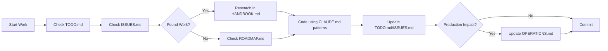

# 🧠 CLAUDE.md - Operational Brain

*Critical information for working with Threadly codebase*

**Last Updated**: January 10, 2025

## 🎯 PROJECT CONTEXT
**Threadly** = Premium C2C fashion marketplace (Vinted competitor)
- **Tech Stack**: Next.js 15, TypeScript, Turborepo, Prisma, Stripe
- **Architecture**: 3 apps (/web = public, /app = dashboard, /api = backend)
- **Status**: 100% MVP complete, production ready

## ⚡ QUICK COMMANDS

```bash
# ALWAYS USE THESE
pnpm dev          # Start everything
pnpm build        # Build all apps
pnpm typecheck    # Check types before commit
pnpm db:push      # Update database schema
pnpm db:seed      # Add test data

# DEBUG COMMANDS
pnpm why [package]      # Check why package exists
pnpm ls [package]       # List package versions
turbo daemon clean      # Fix turbo cache issues
```

## 🚨 CRITICAL PATTERNS

### 1. NEVER Create Files Unless Essential
- **Check existing files first** - we have too many already
- **Edit > Create** - always prefer editing
- **No README.md files** - use the 5 main docs

### 2. Database Access Pattern
```typescript
// ALWAYS use this pattern for database queries
import { database } from '@repo/database';
import { getCacheService } from '@repo/cache';

// Initialize cache for performance
const cache = getCacheService({
  url: process.env.UPSTASH_REDIS_REST_URL || process.env.REDIS_URL,
  token: process.env.UPSTASH_REDIS_REST_TOKEN,
});

// Include related data to avoid N+1 with caching
const products = await cache.remember(
  'products:all',
  async () => {
    return database.product.findMany({
      include: {
        images: { orderBy: { displayOrder: 'asc' } },
        seller: { select: { id: true, firstName: true } },
        category: true,
        _count: { select: { favorites: true } }
      }
    });
  },
  300 // Cache for 5 minutes
);
```

### 3. API Route Pattern (Next.js 15)
```typescript
// PARAMS ARE NOW ASYNC!
export async function GET(
  request: NextRequest,
  { params }: { params: Promise<{ id: string }> }
) {
  const resolvedParams = await params; // MUST AWAIT
  const id = resolvedParams.id;
  // ... rest of code
}
```

### 4. Environment Variables
```typescript
// Use packages/[package]/keys.ts pattern
import { keys as authKeys } from '@repo/auth/keys';
import { keys as paymentKeys } from '@repo/payments/keys';

// In env.ts files
export const env = createEnv({
  extends: [authKeys(), paymentKeys()],
  // ... additional vars
});
```

### 5. State Management
- **Cart**: Zustand in `lib/stores/cart-store.ts`
- **Auth**: Clerk hooks `useUser()`, `useAuth()`
- **Server State**: React Query with 5min cache

## 🐛 COMMON ISSUES & FIXES

### Build Errors
```bash
# TypeScript errors
pnpm typecheck --filter=app

# Clean everything
pnpm clean && pnpm install

# Turbo cache issues
turbo daemon clean && rm -rf .turbo
```

### Database Issues
```bash
# Reset database
pnpm db:push --force-reset
pnpm db:seed

# View data
pnpm db:studio
```

### Deployment Failures
1. Check environment variables in Vercel
2. Ensure all `NEXT_PUBLIC_` vars are set
3. Default values for optional vars
4. Check build logs for missing packages

## 📁 KEY FILES TO KNOW

### Configuration
- `/turbo.json` - Build pipeline
- `/.env.example` - All env vars documented
- `/packages/*/keys.ts` - Env validation

### Database
- `/packages/database/prisma/schema.prisma` - Source of truth
- `/scripts/seed-*.ts` - Test data generators

### Critical Components
- `/apps/app/components/product-form.tsx` - Complex form example
- `/apps/web/components/product-grid-server.tsx` - Server component pattern
- `/apps/app/app/api/stripe/connect/route.ts` - Stripe integration

## 🔥 WORKFLOW RULES

### Daily Workflow
1. **Check STATUS.md** → See current state & active issues
2. **Review ISSUES.md** → Find new problems while coding
3. **Pick from NEXT section** → Focus on one task
4. **Update as you go** → Keep STATUS.md current
5. **Test before commit** → Run typecheck

### When You Find Issues
1. **Document in ISSUES.md** → Add with file path & line numbers
2. **Assess priority** → Critical? Add to STATUS.md
3. **Tag appropriately** → Bug, Todo, Incomplete, Security, etc.

## 🔄 THE THREADLY CONTINUOUS IMPROVEMENT WORKFLOW

**THE PERFECT AUTONOMOUS DEVELOPMENT CYCLE**

This is our **PRIMARY WORKFLOW** - the systematic approach to building production-grade software while maintaining code quality. It creates a self-sustaining cycle of improvement that works even while you sleep.

## 📚 THE 5-FILE ECOSYSTEM

### 1. **CLAUDE.md** (This File) 🧠
- **Purpose**: Operation manual and patterns library
- **When to Read**: Before any work, for patterns and commands
- **Updates**: When new patterns are discovered or commands change

### 2. **ISSUES.md** 🐛  
- **Purpose**: Technical debt registry with exact file paths and line numbers
- **When to Read**: To find specific work to do
- **Updates**: Add issues during audits, mark ✅ when fixed

### 3. **TODO.md** ✅
- **Purpose**: Active sprint tasks extracted from ISSUES.md
- **When to Read**: To track current work progress
- **Updates**: Extract from ISSUES.md, mark complete when done

### 4. **OPERATIONS.md** 🚀
- **Purpose**: Production status, deployment procedures, system health
- **When to Read**: Before deployments, when checking system status
- **Updates**: When production changes or new procedures are added

### 5. **ROADMAP.md** 🗺️
- **Purpose**: Long-term vision, feature planning, business priorities
- **When to Read**: For strategic decisions and feature prioritization
- **Updates**: Monthly roadmap reviews and feature completions

---

## 🔄 THE AUTONOMOUS IMPROVEMENT CYCLE

### **PHASE 1: AUDIT & DISCOVER** 🔍
> **Goal**: Find issues before they become problems

**Process:**
1. **Run Codebase Audit**
   ```bash
   # Run comprehensive analysis
   grep -r "console\." apps/ --include="*.ts" --include="*.tsx"
   find . -name "*.tsx" | xargs grep -l "TODO\|FIXME\|HACK"
   pnpm typecheck
   ```

2. **Check for Anti-patterns**
   - Duplicate components across apps
   - Deep relative imports (`../../../`)
   - Client components that should be server components
   - Missing error boundaries and loading states
   - Performance bottlenecks

3. **Document Findings in ISSUES.md**
   - Use exact file paths and line numbers
   - Categorize: Critical → High → Medium → Low
   - Add estimated fix time and impact

**🔗 Navigation:** Go to ISSUES.md → Add newly discovered issues → Return here

---

### **PHASE 2: PRIORITIZE & PLAN** 📋
> **Goal**: Convert issues into actionable tasks

**Process:**
1. **Read ISSUES.md Systematically**
   - Start with Critical issues (production blockers)
   - Move to High priority (user-facing bugs)
   - Consider Medium/Low based on time available

2. **Extract 5-10 Tasks to TODO.md**
   - Break complex issues into smaller steps
   - Use TodoWrite tool for tracking
   - Set realistic completion timeframes

3. **Research Implementation**
   - Check Next Forge docs for patterns
   - Review existing codebase for similar solutions
   - Plan implementation approach

**🔗 Navigation:** From ISSUES.md → Extract to TODO.md → Return here

---

### **PHASE 3: IMPLEMENT & FIX** 💻
> **Goal**: Execute fixes systematically and test thoroughly

**Process:**
1. **Work Through TODO List**
   - Mark tasks as in_progress
   - Implement using established patterns
   - Test each fix before moving to next

2. **Follow Implementation Standards**
   ```bash
   # Before any code change
   pnpm typecheck
   
   # After implementation
   pnpm build
   pnpm test  # if tests exist
   ```

3. **Update ISSUES.md as You Go**
   - Mark issues as ✅ FIXED when completed
   - Move to "Recently Fixed" section
   - Add any new issues discovered during work

**🔗 Navigation:** From TODO.md → Fix issues → Update ISSUES.md → Return here

---

### **PHASE 4: VERIFY & DEPLOY** 🚀
> **Goal**: Ensure fixes work in production environment

**Process:**
1. **Pre-deployment Checklist**
   ```bash
   # Critical checks
   pnpm typecheck    # Must pass
   pnpm build        # Must pass
   grep -r "console\." apps/ --include="*.ts" --include="*.tsx" # Should be empty
   ```

2. **Update OPERATIONS.md**
   - Document any production changes
   - Update deployment procedures if needed
   - Note any new monitoring requirements

3. **Track Success Metrics**
   - Performance improvements
   - Bug reduction
   - User experience enhancements

**🔗 Navigation:** Update OPERATIONS.md → Plan next cycle

---

### **PHASE 5: LEARN & IMPROVE** 📈
> **Goal**: Continuous optimization of the workflow itself

**Process:**
1. **Review Cycle Effectiveness**
   - How many issues were fixed?
   - What patterns emerged?
   - Which tools were most helpful?

2. **Update ROADMAP.md**
   - Mark completed features
   - Adjust priorities based on learnings
   - Plan next major initiatives

3. **Enhance CLAUDE.md**
   - Add new patterns discovered
   - Update commands that proved useful
   - Refine the workflow based on experience

**🔗 Navigation:** Update ROADMAP.md → Update this file → Start new cycle

---

## 🎯 QUICK START: DAILY WORKFLOW

### **Morning Routine (15 minutes)**
1. **Check ISSUES.md** → Find today's priority
2. **Update TODO.md** → Extract 3-5 tasks
3. **Read CLAUDE.md** → Review patterns for today's work

### **Development Session (2-4 hours)**
1. **Work through TODO tasks** → Mark in_progress/completed
2. **Follow implementation patterns** → Use established approaches
3. **Update ISSUES.md** → Mark fixes, add new discoveries

### **End of Session (10 minutes)**
1. **Run quality checks** → typecheck, build
2. **Commit with good messages** → Reference fixed issues
3. **Plan tomorrow** → Leave clear TODO for next session

---

## 🔥 EMERGENCY WORKFLOWS

### **Production Bug (CRITICAL)**
1. **Skip to ISSUES.md** → Add critical issue
2. **Extract to TODO immediately** → Single focus
3. **Fix with proven patterns** → No experimentation
4. **Deploy and verify** → Monitor closely

### **Feature Request (PLANNED)**
1. **Add to ROADMAP.md** → Plan implementation
2. **Research in CLAUDE.md** → Find patterns
3. **Break down in TODO.md** → Manageable tasks
4. **Implement systematically** → Test thoroughly

### **Technical Debt (ONGOING)**
1. **Audit and find issues** → Add to ISSUES.md
2. **Prioritize by impact** → Critical first
3. **Batch similar fixes** → Efficiency
4. **Document improvements** → Update patterns

---

## 📊 SUCCESS METRICS

**Cycle Effectiveness:**
- ✅ Issues discovered per cycle: 10-20
- ✅ Issues fixed per cycle: 5-15
- ✅ New patterns documented: 2-5
- ✅ Zero production breaking changes

**Code Quality:**
- ✅ Zero console.log in production
- ✅ 100% TypeScript compliance
- ✅ No duplicate components
- ✅ Consistent patterns across apps

---

## 🚨 CRITICAL WORKFLOW RULES

### **1. Always Use the Cycle**
- Never skip the ISSUES.md → TODO.md → Fix → Update cycle
- Document everything, even small discoveries
- Follow patterns, don't invent new approaches mid-task

### **2. Maintain File Integrity**
- Each file has a specific purpose - respect it
- Cross-reference between files using clear navigation
- Update files immediately when changes occur

### **3. Quality Gates**
- `pnpm typecheck` must pass before any commit
- No console.log statements in production code
- Test fixes before marking issues as resolved

### **4. Navigation Discipline**
- Use the 🔗 Navigation links to move between files
- Always return to CLAUDE.md for next steps
- Complete cycles, don't leave work half-finished

---

## 📖 PATTERN LIBRARY (QUICK REFERENCE)

**Database Access:**
```typescript
import { database } from '@repo/database';
import { getCacheService } from '@repo/cache';

const cache = getCacheService({
  url: process.env.UPSTASH_REDIS_REST_URL,
  token: process.env.UPSTASH_REDIS_REST_TOKEN,
});

const products = await cache.remember('products:all', async () => {
  return database.product.findMany({
    include: { images: { orderBy: { displayOrder: 'asc' } } }
  });
}, 300);
```

**Next.js 15 API Routes:**
```typescript
export async function GET(
  request: NextRequest,
  { params }: { params: Promise<{ id: string }> }
) {
  const resolvedParams = await params;
  const id = resolvedParams.id;
}
```

**Server/Client Component Split:**
```typescript
// Server Component (default)
export default async function ProductList() {
  const products = await database.product.findMany();
  return <ProductGrid products={products} />;
}

// Client Component (only when needed)
'use client';
export function AddToCartButton() {
  const addItem = useCartStore(state => state.addItem);
  return <Button onClick={() => addItem(product)}>Add</Button>;
}
```

---

## 🔄 **START YOUR NEXT CYCLE HERE**

**Ready to begin? Follow this exact sequence:**

1. **🔍 AUDIT PHASE** → Open ISSUES.md, add 5-10 new issues from codebase review
2. **📋 PLAN PHASE** → Extract 3-5 high-priority issues to TODO.md  
3. **💻 IMPLEMENT PHASE** → Fix issues using patterns from this file
4. **🚀 VERIFY PHASE** → Test fixes, update OPERATIONS.md if needed
5. **📈 IMPROVE PHASE** → Update ROADMAP.md, enhance this workflow

**🔗 Next Action: Go to ISSUES.md → Scan for highest priority issue → Return here with TodoWrite plan**

---

*This workflow creates autonomous improvement cycles that build production-grade software consistently. Trust the process.*

## 🤖 AUTOMATION OPPORTUNITIES

### **Script-Based Automation**
```bash
# Create audit script (./scripts/audit-codebase.sh)
#!/bin/bash
echo "🔍 Running codebase audit..."
grep -r "console\." apps/ --include="*.ts" --include="*.tsx" | wc -l
find . -name "*.tsx" | xargs grep -l "TODO\|FIXME\|HACK" | wc -l
pnpm typecheck 2>&1 | grep -c "error"
echo "✅ Audit complete"
```

### **MCP Integration**
- **Custom MCP** for automated issue detection
- **GitHub Actions** for continuous quality monitoring
- **Pre-commit hooks** for pattern enforcement

### **Future Enhancements**
- Automated TODO extraction from ISSUES.md
- Performance monitoring integration
- Dependency version checking automation

### 5. New Patterns (Added Jan 10)
```typescript
// Analytics tracking
import { usePostHog } from '@repo/analytics';
const posthog = usePostHog();
posthog.capture('product_viewed', { productId, price });

// Lazy loading images
import { ProductImage, LazyImage } from '@repo/design-system';
<ProductImage src={imageUrl} alt={alt} aspectRatio="3/4" />

// Animations
import { Animated, StaggerContainer } from '@repo/design-system';
<Animated animation="fadeInUp" trigger="inView">
  <Card>Content</Card>
</Animated>
```

## 🎨 UI/UX PATTERNS

### **📖 COMPREHENSIVE GUIDE: See DESIGN_SYSTEM.md**
- **40+ Production Components** with Storybook documentation
- **Advanced Animation System** with 50+ motion patterns
- **OKLCH Color Tokens** for brand consistency
- **Enterprise-Grade Architecture** ready for scale

### Components
- **UI Library**: shadcn/ui + custom design system
- **Styling**: Tailwind CSS only (no CSS files)
- **Icons**: Lucide React
- **Forms**: React Hook Form + Zod

### Component Structure
```tsx
// Server Component (default)
export default async function ProductList() {
  const products = await database.product.findMany();
  return <ProductGrid products={products} />;
}

// Client Component (only when needed)
'use client';
export function AddToCartButton() {
  const addItem = useCartStore(state => state.addItem);
  return <Button onClick={() => addItem(product)}>Add</Button>;
}
```

## 🚀 PRODUCTION CHECKLIST

### Must Have
- [ ] PostgreSQL database (not SQLite)
- [ ] All env vars in Vercel
- [ ] Stripe production keys
- [ ] UploadThing configured
- [ ] Resend email service
- [ ] Error tracking (Sentry)

### Should Have  
- [ ] Redis for caching
- [ ] CDN for images
- [ ] Rate limiting configured
- [ ] Monitoring (Better Stack)
- [ ] Analytics (PostHog)

## 💡 QUICK WINS

### If you have 30 minutes:
1. Add loading states to components
2. Fix TypeScript errors
3. Add error boundaries
4. Improve form validation messages

### If you have 2 hours:
1. Fix a high-priority bug from ISSUES.md
2. Implement a UI component for existing APIs
3. Add missing API endpoints
4. Write integration tests

## 🎯 REMEMBER

1. **We're building for PRODUCTION** - not a demo
2. **Performance matters** - use server components
3. **Security first** - sanitize inputs, validate everything
4. **User experience** - fast, intuitive, beautiful
5. **Code quality** - TypeScript strict, no any types

---

## 📚 DOCUMENTATION SYSTEM (11 ESSENTIAL FILES)

**Core Documentation:**
1. **README.md** - Project overview and setup guide
2. **CLAUDE.md** (this file) - AI/developer operational guide  
3. **HANDBOOK.md** - Comprehensive technical reference
4. **DESIGN_SYSTEM.md** - Complete UI/UX guide, 40+ components, design tokens, animations

**Planning & Tracking:**
5. **TODO.md** - Active sprint tasks and development priorities
6. **ISSUES.md** - Bug tracker and technical debt with file paths
7. **ROADMAP.md** - Product vision and feature planning

**Production & Operations:**
8. **OPERATIONS.md** - Production status & deployment procedures
9. **PRODUCTION_FINALIZATION.md** - Master launch plan with all requirements ⭐ NEW
10. **web.md** - Web app specific production tasks ⭐ NEW
11. **app.md** - Dashboard app specific production tasks ⭐ NEW

**Key Separation**:
- Use **TODO.md** for "what we're building" (features, tasks)
- Use **ISSUES.md** for "what's broken" (bugs, debt)
- Use **PRODUCTION_FINALIZATION.md** for overall launch strategy
- Use **web.md** and **app.md** for app-specific implementation

## 🔄 OPTIMAL WORKFLOW



### 1️⃣ Starting Work
- Open **TODO.md** → See active development tasks
- Check **ISSUES.md** → Find bugs that need fixing
- Read **CLAUDE.md** → Review patterns and commands  
- Check **HANDBOOK.md** → Understand technical implementation

### 2️⃣ During Development
- Follow code patterns from CLAUDE.md
- Run `pnpm typecheck` frequently
- Update ISSUES.md as you fix things
- Use exact file paths from ISSUES.md

### 3️⃣ Before Committing  
- Run `pnpm typecheck && pnpm build`
- Update ISSUES.md (move to "Recently Fixed")
- Update OPERATIONS.md (if production-related)
- Write descriptive commit messages

---

*Last updated: January 10, 2025*