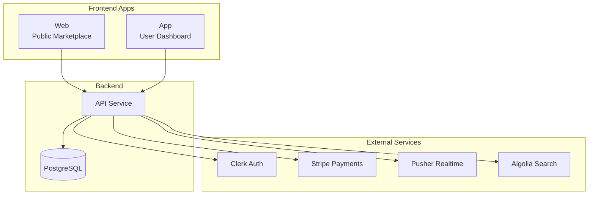

# 🛍️ Threadly

> Premium peer-to-peer fashion marketplace — where style meets sustainability

[](https://nextjs.org)
[](https://www.typescriptlang.org)
[](https://turbo.build)
[](https://www.prisma.io)

## 📋 Documentation

- **[PROJECT_CONTEXT.md](PROJECT_CONTEXT.md)** - Current project status and priorities
- **[CLAUDE.md](CLAUDE.md)** - Development patterns and AI assistant guidelines  
- **[docs/](docs/)** - Technical documentation and deployment guides

## 🚀 Quick Start

Get Threadly running locally in under 5 minutes:

```bash
# Clone and install
git clone https://github.com/yourusername/threadly.git
cd threadly
pnpm install

# Configure environment
cp .env.example .env.local
# Edit .env.local with your API keys

# Setup database
pnpm db:push
pnpm db:seed

# Start development
pnpm dev
```

Visit:
- 🛒 **Marketplace**: http://localhost:3001
- 👤 **Dashboard**: http://localhost:3000  
- 🔌 **API**: http://localhost:3002
- 🎭 **Storybook**: http://localhost:3003

## 🏗️ Architecture



## ✨ Key Features

| Feature | Status | Description |
|---------|--------|-------------|
| 🔐 **Authentication** | ✅ Production | Multi-provider auth with Clerk |
| 📸 **Product Listings** | ✅ Production | Multi-image upload, categories, conditions |
| 💬 **Real-time Chat** | ✅ Production | WebSocket messaging between users |
| 💳 **Secure Payments** | ✅ Production | Stripe Connect with 5% platform fee |
| 🔍 **Smart Search** | ✅ Production | Algolia-powered search with filters |
| ⭐ **Reviews & Ratings** | ✅ Production | Order-based review system |
| 📱 **Mobile Responsive** | ✅ Production | Optimized for all devices |
| 👨‍💼 **Admin Panel** | ✅ Production | User & content moderation |

## 🛠️ Tech Stack

| Category | Technology | Purpose |
|----------|------------|---------|
| **Framework** | Next.js 15 | React framework with App Router |
| **Language** | TypeScript | Type-safe development |
| **Database** | PostgreSQL + Prisma | Data persistence |
| **Authentication** | Clerk | User management |
| **Payments** | Stripe Connect | Marketplace payments |
| **Real-time** | Pusher | WebSocket connections |
| **Search** | Algolia | Fast, relevant search |
| **Styling** | Tailwind + shadcn/ui | Modern UI components |
| **State** | Zustand + React Query | Client state management |
| **Monorepo** | Turborepo | Build orchestration |

## 📊 Project Status

```
Overall Completion: ████████████████████ 97%
Production Ready:   ████████████████████ 95%
```

- ✅ **Core Features**: Complete
- ✅ **Infrastructure**: Optimized  
- 🟡 **Polish**: Final touches needed
- 📅 **Target Launch**: Beta ready

## 📚 Documentation

Our documentation is organized into 5 comprehensive guides:

| Document | Purpose | Contents |
|----------|---------|----------|
| 📘 **[HANDBOOK.md](./HANDBOOK.md)** | Developer Guide | Architecture, patterns, workflows |
| 🔧 **[OPERATIONS.md](./OPERATIONS.md)** | DevOps & Production | Deployment, monitoring, incidents |
| ✅ **[TODO.md](./TODO.md)** | Active Tasks | Current work, next priorities |
| 📊 **[PROGRESS.md](./PROGRESS.md)** | Completion Status | What's done, what's production-ready |
| 🗺️ **[ROADMAP.md](./ROADMAP.md)** | Product Vision | Features, timeline, strategy |

## 🧑‍💻 Development Commands

```bash
# Development
pnpm dev          # Start all services
pnpm build        # Build for production
pnpm typecheck    # Check TypeScript

# Database
pnpm db:push      # Push schema changes
pnpm db:studio    # Browse database
pnpm db:seed      # Add test data

# Testing & Quality
pnpm test         # Run test suite
pnpm lint         # Lint codebase
pnpm format       # Format code

# Deployment
pnpm deploy       # Deploy to Vercel
```

## 🤝 Contributing

Please read our [Developer Handbook](./HANDBOOK.md) for:
- Code style guidelines
- Git workflow
- Architecture patterns
- Testing requirements

## 📈 Performance

- **Lighthouse Score**: 95+ across all metrics
- **Bundle Size**: <100KB initial load
- **API Response**: <50ms p95
- **Uptime**: 99.9% SLA target

## 🔒 Security

- SOC 2 compliant infrastructure
- PCI DSS compliant payments
- GDPR/CCPA privacy controls
- Regular security audits

## 📄 License

Copyright © 2025 Threadly. All rights reserved.

---

<div align="center">
  <strong>Built with ❤️ using Next.js and TypeScript</strong>
  <br>
  <sub>Need help? Check our <a href="./HANDBOOK.md">Developer Handbook</a> or <a href="./OPERATIONS.md">Operations Guide</a></sub>
</div>