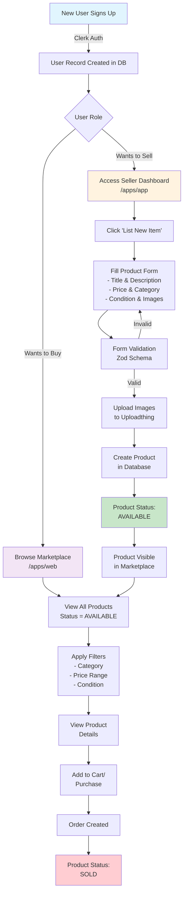

# Product Flow Diagram

## Complete Product Lifecycle in Threadly



## Detailed Step-by-Step Flow

### 1. User Registration Phase
```
┌─────────────────┐
│  User Signs Up  │
│  via Clerk UI   │
└────────┬────────┘
         │
         ▼
┌─────────────────┐
│ Clerk Creates   │
│ Auth Record     │
└────────┬────────┘
         │
         ▼
┌─────────────────┐
│ App Creates DB  │
│ User Record     │
│ - clerkId       │
│ - email         │
│ - profile info  │
└─────────────────┘
```

### 2. Product Creation Phase
```
┌─────────────────┐
│ Seller Logs In  │
│ to /apps/app    │
└────────┬────────┘
         │
         ▼
┌─────────────────┐
│ Navigate to     │
│ /selling/new    │
└────────┬────────┘
         │
         ▼
┌─────────────────────────┐
│ Fill Product Form       │
│ ┌─────────────────────┐ │
│ │ • Title (required)  │ │
│ │ • Description       │ │
│ │ • Price ($0.01+)    │ │
│ │ • Category ▼        │ │
│ │ • Condition ▼       │ │
│ │ • Brand (optional)  │ │
│ │ • Size (optional)   │ │
│ │ • Color (optional)  │ │
│ │ • Images (1-5)      │ │
│ └─────────────────────┘ │
└────────┬────────────────┘
         │
         ▼
┌─────────────────┐
│ Client-side     │
│ Validation      │
└────────┬────────┘
         │
         ▼
┌─────────────────┐
│ Upload Images   │
│ to Uploadthing  │
└────────┬────────┘
         │
         ▼
┌─────────────────┐
│ Server Action   │
│ createProduct() │
└────────┬────────┘
         │
         ▼
┌─────────────────────────┐
│ Database Transaction    │
│ • Create Product Record │
│ • Set status=AVAILABLE  │
│ • Create Image Records  │
│ • Link to Seller        │
└─────────────────────────┘
```

### 3. Product Display Phase
```
┌─────────────────┐
│ Buyer Visits    │
│ /apps/web       │
└────────┬────────┘
         │
         ▼
┌─────────────────────────┐
│ Server Component Runs   │
│ database.product.       │
│   findMany({            │
│     where: {            │
│       status:           │
│         'AVAILABLE'     │
│     }                   │
│   })                    │
└────────┬────────────────┘
         │
         ▼
┌─────────────────┐
│ Products Render │
│ in Grid/List    │
└────────┬────────┘
         │
         ▼
┌─────────────────────────┐
│ User Can:              │
│ • Filter by Category   │
│ • Filter by Price      │
│ • Filter by Condition  │
│ • Sort (New/Price/Pop) │
│ • Search               │
└─────────────────────────┘
```

### 4. Category Assignment Flow
```
Product Creation:
┌──────────────┐     ┌─────────────┐     ┌──────────────┐
│ User Selects │ --> │ categoryId  │ --> │ Product      │
│ "Women's     │     │ = "abc123"  │     │ Saved with   │
│ Dresses"     │     │             │     │ Category     │
└──────────────┘     └─────────────┘     └──────────────┘

Product Display:
┌──────────────┐     ┌─────────────┐     ┌──────────────┐
│ Filter:      │ --> │ WHERE       │ --> │ Only Women's │
│ Women's      │     │ category.   │     │ Dresses      │
│ Dresses      │     │ name LIKE   │     │ Shown        │
└──────────────┘     └─────────────┘     └──────────────┘
```

## Real-time Data Sync

```
          ┌─────────────────┐
          │ Neon PostgreSQL │
          │    Database     │
          └────────┬────────┘
                   │
      ┌────────────┴────────────┐
      │                         │
┌─────▼──────┐          ┌──────▼─────┐
│ /apps/app  │          │ /apps/web  │
│  WRITES    │          │   READS    │
│ products   │          │  products  │
└────────────┘          └────────────┘

No caching = Instant updates!
```

## Key Points

1. **Instant Visibility**: Products appear immediately after creation
2. **No Manual Steps**: Categories, filtering, search all automatic
3. **Single Database**: Ensures data consistency
4. **Status Control**: Only AVAILABLE products shown to buyers
5. **Secure Flow**: Authentication required for selling

This architecture ensures a smooth, real-time C2C marketplace experience!