# Data Flow Documentation

This document maps how data moves through the Threadly marketplace system, showing the interactions between packages, databases, caches, and external services.

## Table of Contents

1. [System Overview](#system-overview)
2. [User Authentication Flow](#user-authentication-flow)
3. [Product Management Flow](#product-management-flow)
4. [Search and Discovery Flow](#search-and-discovery-flow)
5. [Messaging System Flow](#messaging-system-flow)
6. [Commerce and Transaction Flow](#commerce-and-transaction-flow)
7. [Real-time Communication Flow](#real-time-communication-flow)
8. [Caching Strategy Flow](#caching-strategy-flow)
9. [Error Handling and Monitoring Flow](#error-handling-and-monitoring-flow)
10. [External Service Integration Flow](#external-service-integration-flow)

## System Overview

### High-Level Data Flow
```mermaid
graph TB
    subgraph "External Services"
        CLERK[Clerk Auth]
        STRIPE[Stripe Payments]
        ALGOLIA[Algolia Search]
        PUSHER[Pusher Real-time]
        SENTRY[Sentry Monitoring]
        REDIS[Redis Cache]
    end

    subgraph "Applications"
        WEB[Web App - Port 3001]
        APP[Dashboard App - Port 3000]
        API[API Service - Port 3002]
    end

    subgraph "Database"
        NEON[Neon PostgreSQL]
    end

    subgraph "Package Layer"
        AUTH[@repo/auth]
        DB[@repo/database]
        CACHE[@repo/cache]
        SEARCH[@repo/search]
        MSG[@repo/messaging]
        OBS[@repo/observability]
    end

    %% External connections
    CLERK --> AUTH
    STRIPE --> API
    ALGOLIA --> SEARCH
    PUSHER --> MSG
    SENTRY --> OBS
    REDIS --> CACHE

    %% App connections
    WEB --> AUTH
    WEB --> CACHE
    WEB --> SEARCH
    APP --> AUTH
    APP --> DB
    APP --> MSG
    API --> AUTH
    API --> DB

    %% Database connections
    DB --> NEON
    AUTH --> DB
    SEARCH --> DB
    MSG --> DB

    %% Monitoring
    OBS --> SENTRY
    OBS --> API
    OBS --> APP
    OBS --> WEB
```

## User Authentication Flow

### Initial Login Process
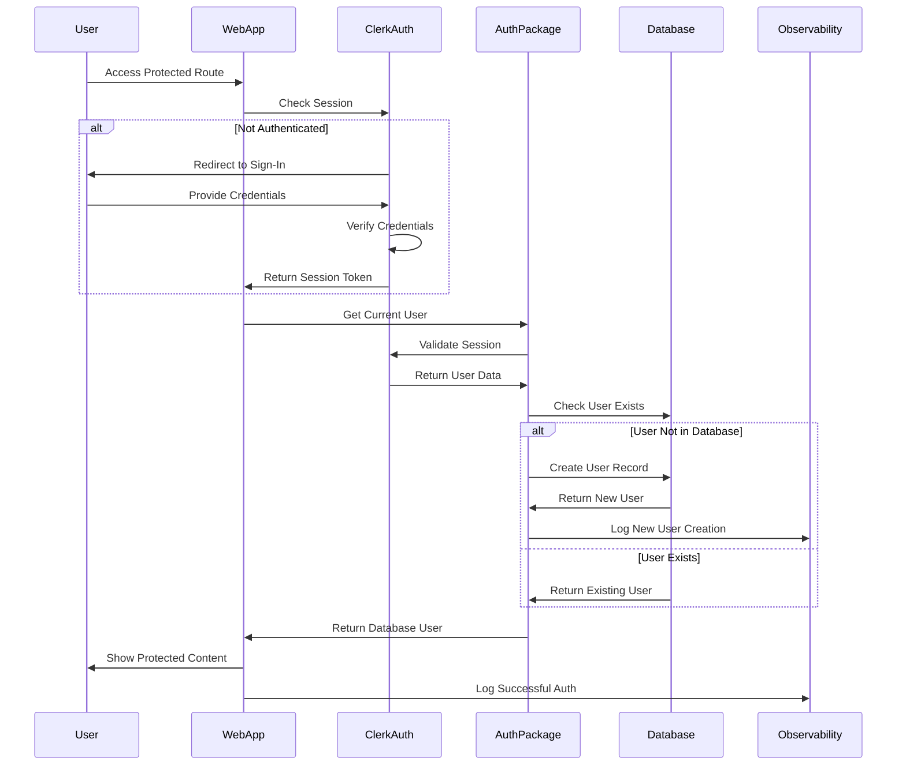

### Data Transformation in Auth Flow
```typescript
// Clerk User → Database User transformation
const clerkUser = await currentUser(); // From @repo/auth/server

const dbUser = await database.user.upsert({
  where: { clerkId: clerkUser.id },
  create: {
    clerkId: clerkUser.id,
    email: clerkUser.emailAddresses[0]?.emailAddress || '',
    firstName: clerkUser.firstName || null,
    lastName: clerkUser.lastName || null,
    imageUrl: clerkUser.imageUrl || null,
    createdAt: new Date(),
  },
  update: {
    email: clerkUser.emailAddresses[0]?.emailAddress || '',
    firstName: clerkUser.firstName || null,
    lastName: clerkUser.lastName || null,
    imageUrl: clerkUser.imageUrl || null,
    lastActiveAt: new Date(),
  }
});
```

## Product Management Flow

### Product Creation Flow
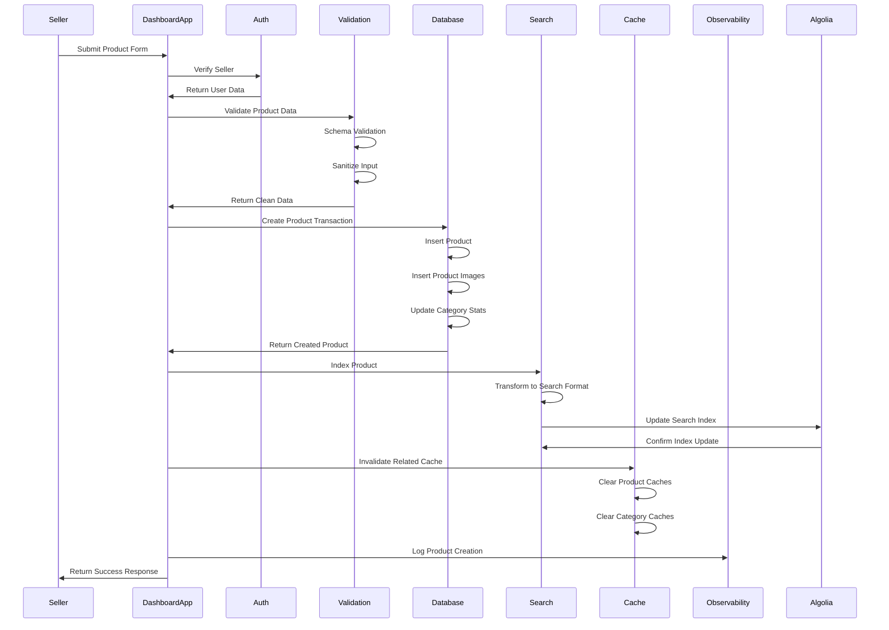

### Product Data Transformation Pipeline
```typescript
// Raw Form Data → Validated Data → Database Record → Search Document

// 1. Raw form input
interface RawProductInput {
  title: string;
  description: string;
  price: string; // String from form
  categoryId: string;
  images: string[];
  // ... other fields
}

// 2. Validated and sanitized
interface ValidatedProduct {
  title: string;        // Sanitized HTML
  description: string;  // Sanitized HTML
  price: number;        // Converted to number
  categoryId: string;   // UUID validated
  images: string[];     // URL validated
  sellerId: string;     // Database user ID
}

// 3. Database record
interface DatabaseProduct {
  id: string;
  title: string;
  description: string;
  price: Decimal;       // Prisma Decimal type
  categoryId: string;
  sellerId: string;
  status: ProductStatus;
  createdAt: Date;
  updatedAt: Date;
  // Relations expanded when needed
}

// 4. Search document
interface SearchProduct {
  id: string;
  title: string;
  description: string;
  price: number;        // Back to number for search
  categoryName: string; // Denormalized
  sellerName: string;   // Denormalized
  tags: string[];       // Generated
  images: string[];
  createdAt: number;    // Unix timestamp
  // Search-specific fields
}
```

## Search and Discovery Flow

### Search Query Flow
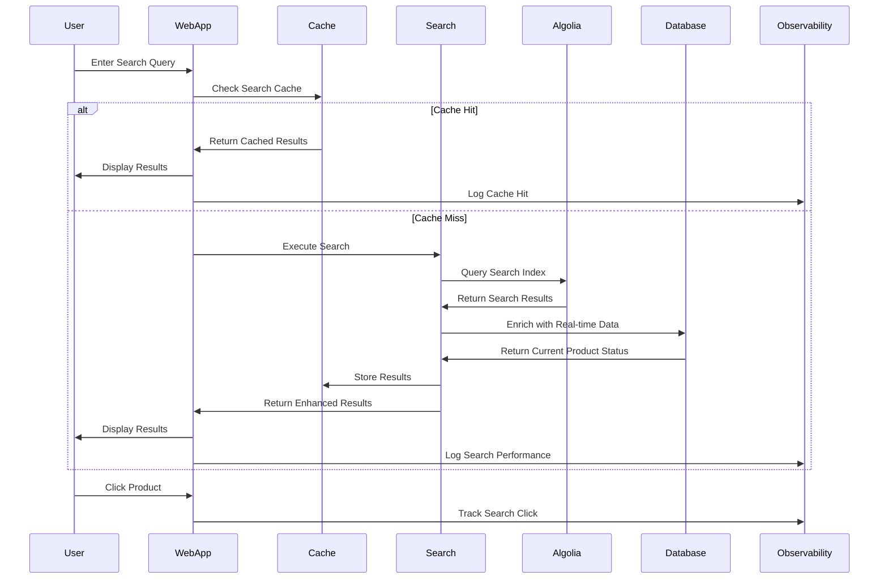

### Search Data Enrichment Process
```typescript
// Algolia Results → Database Enrichment → Final Results

// 1. Algolia search results
interface AlgoliaResult {
  objectID: string;
  title: string;
  price: number;
  images: string[];
  // ... search fields
}

// 2. Database enrichment query
const enrichedProducts = await database.product.findMany({
  where: {
    id: { in: algoliaResults.map(r => r.objectID) },
    status: 'AVAILABLE' // Real-time status check
  },
  include: {
    seller: { select: { firstName: true, lastName: true, averageRating: true } },
    _count: { select: { favorites: true, views: true } }
  }
});

// 3. Merge Algolia + Database data
const finalResults = algoliaResults.map(algoliaProduct => {
  const dbProduct = enrichedProducts.find(p => p.id === algoliaProduct.objectID);
  return {
    ...algoliaProduct,
    isAvailable: dbProduct?.status === 'AVAILABLE',
    sellerRating: dbProduct?.seller.averageRating,
    favoriteCount: dbProduct?._count.favorites || 0,
    viewCount: dbProduct?._count.views || 0
  };
}).filter(product => product.isAvailable);
```

## Messaging System Flow

### Message Send Flow
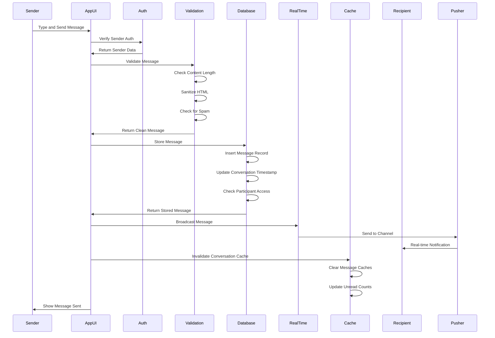

### Message Data Pipeline
```typescript
// UI Input → Validation → Database → Real-time → Cache Update

// 1. Raw message input
interface MessageInput {
  conversationId: string;
  content: string;
  imageUrl?: string;
}

// 2. Validated message
interface ValidatedMessage {
  conversationId: string;
  senderId: string;      // From auth
  content: string;       // Sanitized
  imageUrl?: string;     // URL validated
  read: false;          // Always false for new messages
}

// 3. Database message record
interface DatabaseMessage {
  id: string;
  conversationId: string;
  senderId: string;
  content: string;
  imageUrl?: string;
  read: boolean;
  createdAt: Date;
  updatedAt: Date;
}

// 4. Real-time event payload
interface RealTimeMessage {
  id: string;
  conversationId: string;
  senderId: string;
  content: string;
  createdAt: string;     // ISO string for JSON
  senderName: string;    // Denormalized
  senderAvatar?: string; // Denormalized
}

// 5. UI message display
interface UIMessage extends DatabaseMessage {
  isOwnMessage: boolean; // Computed
  senderName: string;    // From join
  senderAvatar?: string; // From join
  formattedTime: string; // Computed
}
```

## Commerce and Transaction Flow

### Checkout Process Flow
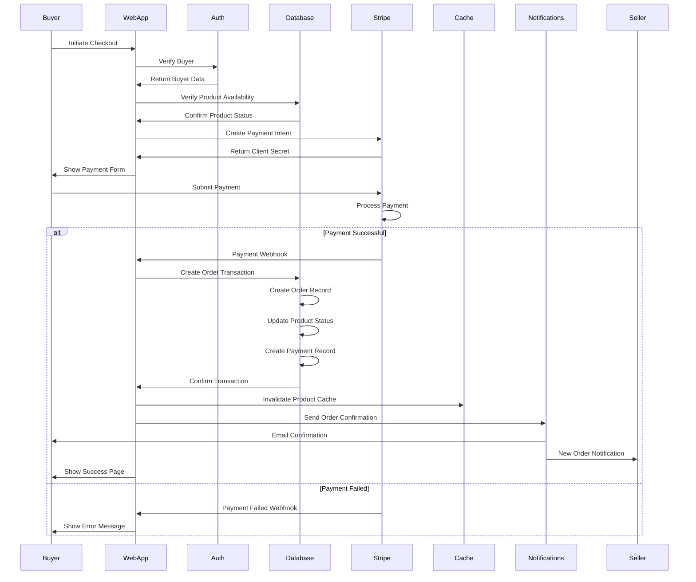

### Transaction Data Coordination
```typescript
// Multi-service transaction coordination

async function processOrderTransaction(paymentIntentId: string) {
  // 1. Verify payment with Stripe
  const paymentIntent = await stripe.paymentIntents.retrieve(paymentIntentId);
  if (paymentIntent.status !== 'succeeded') {
    throw new Error('Payment not confirmed');
  }

  // 2. Database transaction
  const order = await database.$transaction(async (tx) => {
    // Create order
    const order = await tx.order.create({
      data: {
        buyerId: buyerData.id,
        sellerId: product.sellerId,
        productId: product.id,
        amount: paymentIntent.amount / 100, // Convert cents to dollars
        stripePaymentIntentId: paymentIntentId,
        status: 'CONFIRMED'
      }
    });

    // Update product status
    await tx.product.update({
      where: { id: product.id },
      data: { status: 'SOLD' }
    });

    // Create payment record
    await tx.payment.create({
      data: {
        orderId: order.id,
        stripePaymentIntentId: paymentIntentId,
        amount: order.amount,
        status: 'COMPLETED'
      }
    });

    return order;
  });

  // 3. Cache invalidation
  await Promise.all([
    cache.invalidateProduct(product.id),
    cache.invalidateUserOrders(buyerData.id),
    cache.invalidateUserOrders(product.sellerId)
  ]);

  // 4. Search index update
  await searchService.removeProduct(product.id);

  // 5. Send notifications
  await Promise.all([
    notificationService.sendOrderConfirmation(order.id),
    notificationService.sendSellerNotification(order.id)
  ]);

  return order;
}
```

## Real-time Communication Flow

### WebSocket Connection and Event Flow
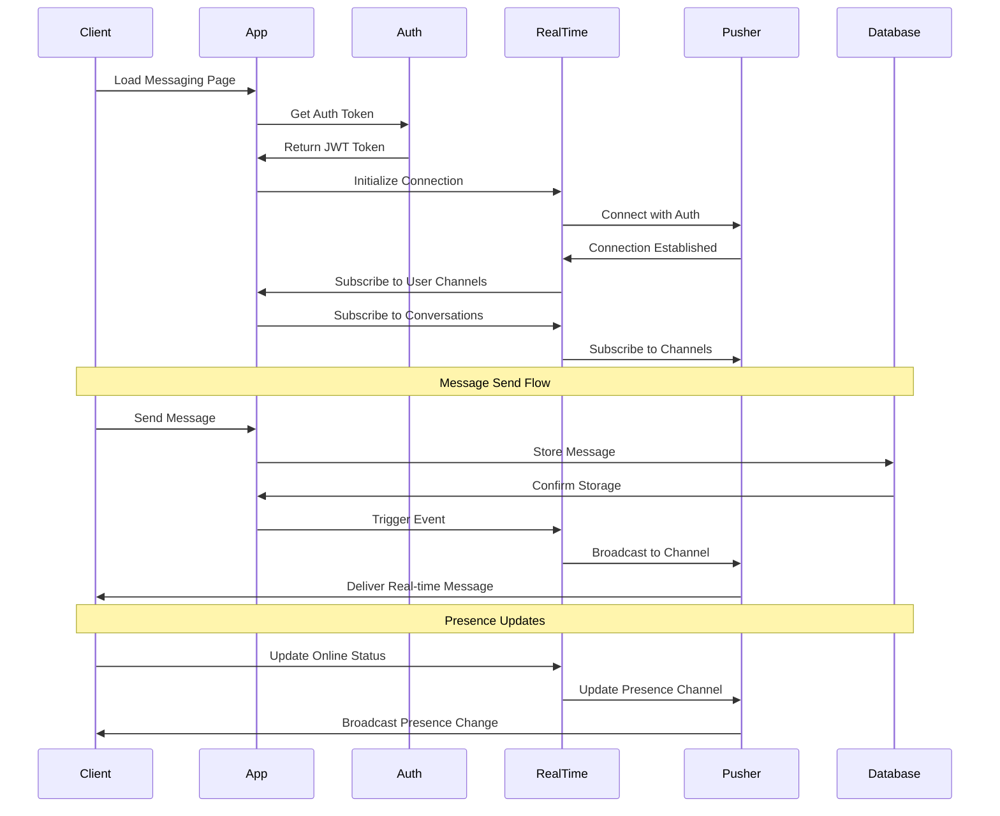

### Real-time Event Types and Data
```typescript
// Real-time event definitions

// 1. Message events
interface MessageEvent {
  type: 'message.new';
  data: {
    id: string;
    conversationId: string;
    senderId: string;
    content: string;
    createdAt: string;
    senderName: string;
  };
}

// 2. Typing indicator events
interface TypingEvent {
  type: 'conversation.typing';
  data: {
    conversationId: string;
    userId: string;
    userName: string;
    isTyping: boolean;
  };
}

// 3. Order status events
interface OrderEvent {
  type: 'order.status_changed';
  data: {
    orderId: string;
    newStatus: OrderStatus;
    productId: string;
    message?: string;
  };
}

// 4. Notification events
interface NotificationEvent {
  type: 'notification.new';
  data: {
    id: string;
    userId: string;
    title: string;
    message: string;
    type: NotificationType;
    createdAt: string;
  };
}
```

## Caching Strategy Flow

### Multi-Layer Caching Architecture
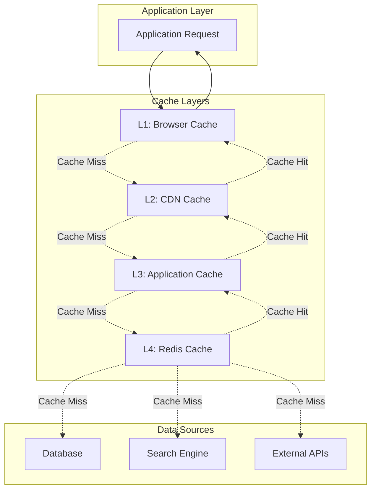

### Cache Invalidation Flow
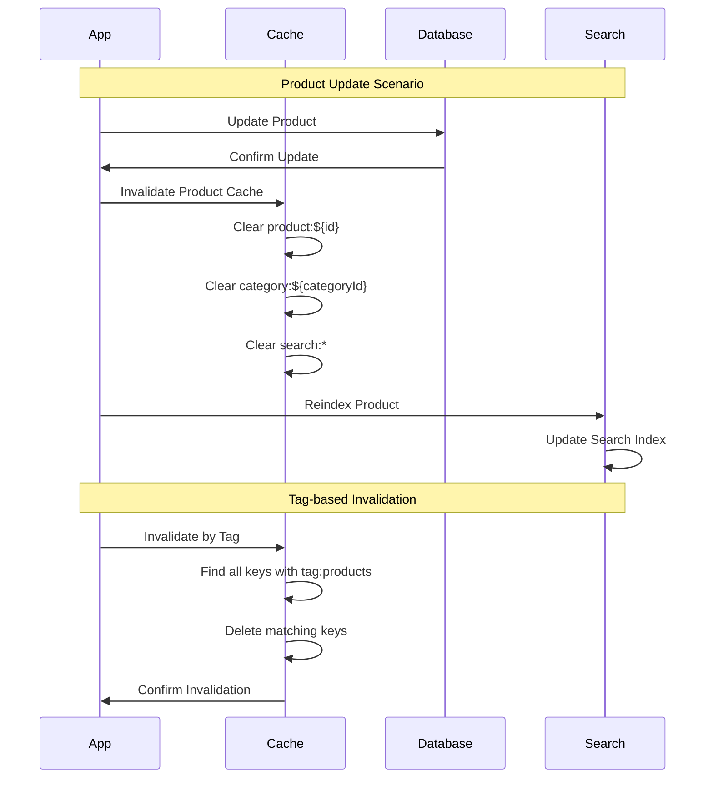

### Cache Data Lifecycle
```typescript
// Cache lifecycle management

class CacheDataLifecycle {
  // 1. Cache population
  async populateCache(key: string, fetcher: () => Promise<any>) {
    const data = await fetcher();
    await this.cache.set(key, data, {
      ttl: this.getTTL(key),
      tags: this.getTags(key)
    });
    return data;
  }

  // 2. Cache validation
  async validateCache(key: string): Promise<boolean> {
    const metadata = await this.cache.getMetadata(key);
    if (!metadata) return false;

    // Check TTL
    if (Date.now() > metadata.expiresAt) return false;

    // Check version
    const currentVersion = await this.getDataVersion(key);
    return metadata.version === currentVersion;
  }

  // 3. Cache refresh
  async refreshCache(key: string, fetcher: () => Promise<any>) {
    // Background refresh to avoid cache stampede
    const refreshPromise = this.populateCache(key, fetcher);
    
    // Return stale data immediately if available
    const staleData = await this.cache.get(key);
    if (staleData) {
      // Refresh in background
      refreshPromise.catch(error => {
        logError('Cache refresh failed:', error);
      });
      return staleData;
    }

    // Wait for fresh data if no stale data
    return refreshPromise;
  }

  // 4. Cache eviction
  async evictCache(pattern: string) {
    const keys = await this.cache.keys(pattern);
    await Promise.all(keys.map(key => this.cache.del(key)));
  }
}
```

## Error Handling and Monitoring Flow

### Error Propagation and Monitoring
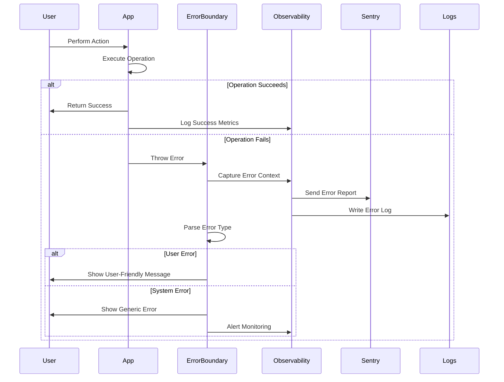

### Monitoring Data Flow
```typescript
// Comprehensive monitoring data collection

interface MonitoringContext {
  // Request context
  requestId: string;
  userId?: string;
  sessionId: string;
  userAgent: string;
  ipAddress: string;

  // Operation context
  operation: string;
  operationType: 'read' | 'write' | 'delete';
  resourceType: string;
  resourceId?: string;

  // Performance metrics
  startTime: number;
  endTime: number;
  duration: number;
  memoryUsage: number;

  // Integration flags
  usedDatabase: boolean;
  usedCache: boolean;
  usedExternalAPI: boolean;
  cacheHitRate?: number;

  // Error context
  error?: {
    name: string;
    message: string;
    stack: string;
    code?: string;
  };
}

// Monitoring data aggregation
class MonitoringAggregator {
  async aggregateMetrics(timeWindow: string) {
    const metrics = {
      requests: {
        total: await this.countRequests(timeWindow),
        successful: await this.countSuccessfulRequests(timeWindow),
        failed: await this.countFailedRequests(timeWindow),
        averageLatency: await this.averageLatency(timeWindow)
      },
      
      database: {
        queries: await this.countDatabaseQueries(timeWindow),
        slowQueries: await this.countSlowQueries(timeWindow),
        averageQueryTime: await this.averageQueryTime(timeWindow)
      },
      
      cache: {
        requests: await this.countCacheRequests(timeWindow),
        hits: await this.countCacheHits(timeWindow),
        hitRate: await this.calculateHitRate(timeWindow)
      },
      
      errors: {
        total: await this.countErrors(timeWindow),
        byType: await this.groupErrorsByType(timeWindow),
        topErrors: await this.getTopErrors(timeWindow)
      }
    };

    return metrics;
  }
}
```

## External Service Integration Flow

### Stripe Payment Integration
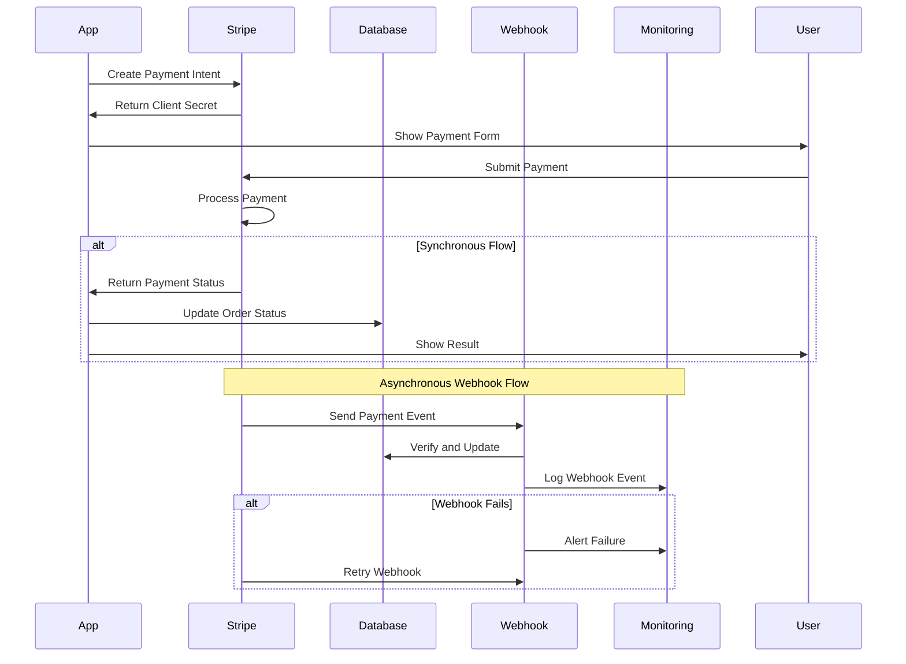

### Data Synchronization with External Services
```typescript
// External service data synchronization patterns

class ExternalServiceSync {
  // 1. Webhook-based sync (preferred)
  async handleWebhook(service: string, event: any) {
    const validator = this.getWebhookValidator(service);
    const isValid = await validator.verify(event);
    
    if (!isValid) {
      throw new Error('Invalid webhook signature');
    }

    await database.$transaction(async (tx) => {
      // Update local data based on external event
      await this.syncData(tx, service, event);
      
      // Record sync event
      await tx.syncEvent.create({
        data: {
          service,
          eventType: event.type,
          eventId: event.id,
          processedAt: new Date()
        }
      });
    });
  }

  // 2. Polling-based sync (fallback)
  async pollForUpdates(service: string) {
    const lastSync = await this.getLastSyncTime(service);
    const updates = await this.fetchUpdates(service, lastSync);

    for (const update of updates) {
      await this.processUpdate(service, update);
    }

    await this.updateLastSyncTime(service, new Date());
  }

  // 3. Event-driven sync (outbound)
  async syncToExternal(service: string, localData: any) {
    const externalId = await this.createExternalRecord(service, localData);
    
    await database.syncMapping.create({
      data: {
        service,
        localId: localData.id,
        externalId,
        syncStatus: 'SYNCED',
        lastSyncAt: new Date()
      }
    });

    return externalId;
  }
}
```

## Performance Optimization Data Flow

### Query Optimization Pipeline
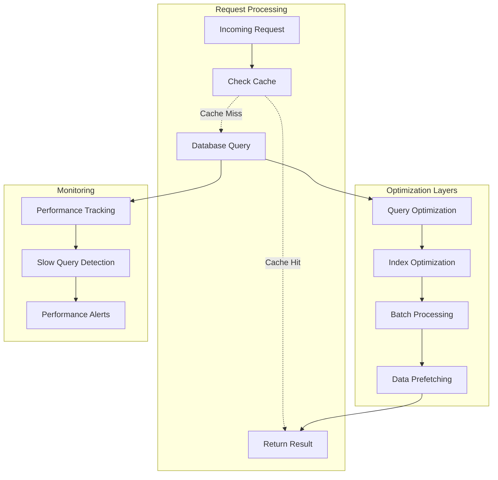

### Data Access Optimization Patterns
```typescript
// Optimized data access patterns

class OptimizedDataAccess {
  // 1. Batch loading with DataLoader
  private productLoader = new DataLoader(async (ids: string[]) => {
    const products = await database.product.findMany({
      where: { id: { in: ids } },
      include: { seller: true, images: true }
    });
    
    return ids.map(id => products.find(p => p.id === id));
  });

  // 2. Prefetch related data
  async getProductWithRelated(id: string) {
    const [product, reviews, similarProducts] = await Promise.all([
      this.productLoader.load(id),
      this.getProductReviews(id),
      this.getSimilarProducts(id)
    ]);

    return { product, reviews, similarProducts };
  }

  // 3. Pagination with cursor-based approach
  async getProductsPaginated(cursor?: string, limit = 20) {
    return database.product.findMany({
      take: limit + 1, // +1 to check if there's a next page
      cursor: cursor ? { id: cursor } : undefined,
      orderBy: { createdAt: 'desc' },
      include: { seller: true, images: { take: 1 } }
    });
  }

  // 4. Aggregation optimization
  async getProductStats() {
    const cacheKey = 'product:stats';
    
    return cache.remember(cacheKey, async () => {
      const [totalProducts, avgPrice, categoryStats] = await Promise.all([
        database.product.count(),
        database.product.aggregate({ _avg: { price: true } }),
        database.product.groupBy({
          by: ['categoryId'],
          _count: { id: true }
        })
      ]);

      return { totalProducts, avgPrice: avgPrice._avg.price, categoryStats };
    }, CACHE_TTL.LONG);
  }
}
```

This comprehensive data flow documentation provides a complete picture of how data moves through the Threadly marketplace system, from user interactions through package integrations to external service communications. Each flow is designed to be resilient, performant, and maintainable while following Next-Forge architectural principles.