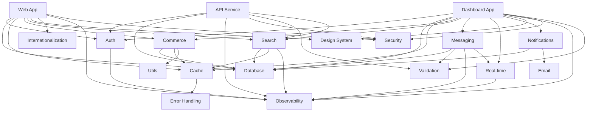
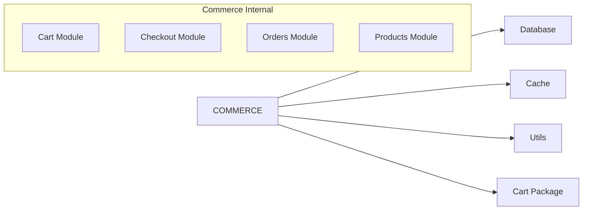
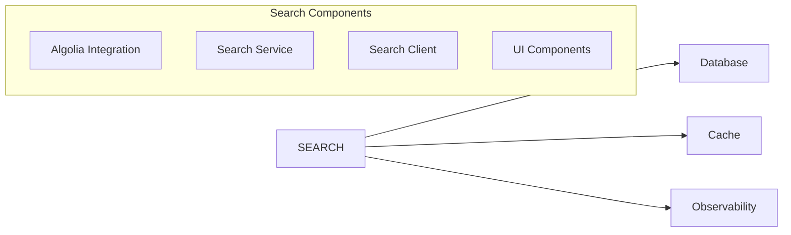
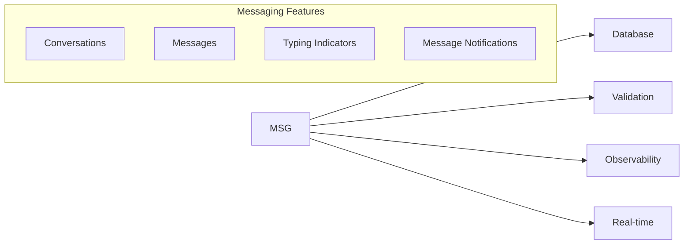
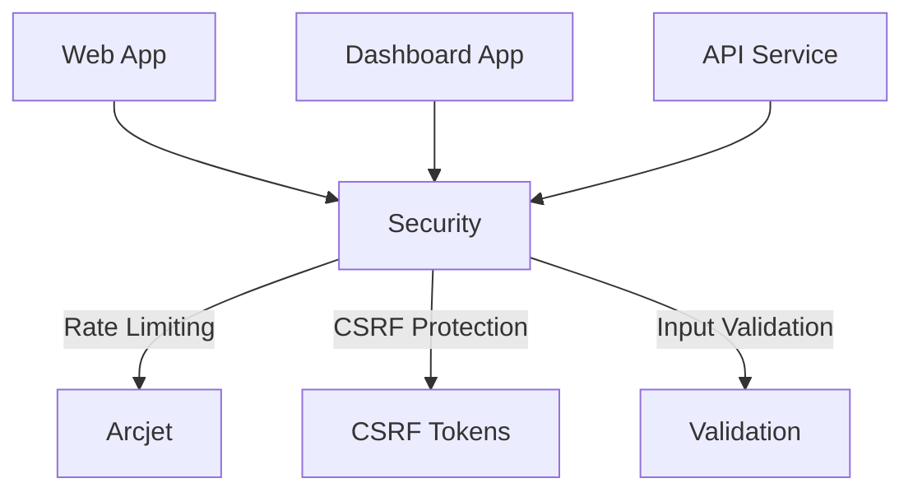
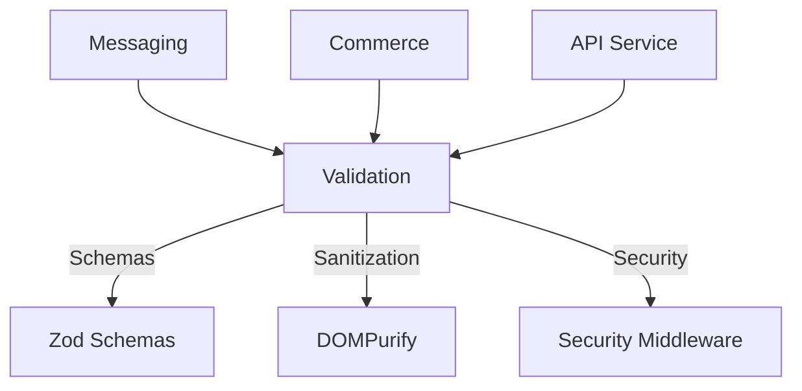
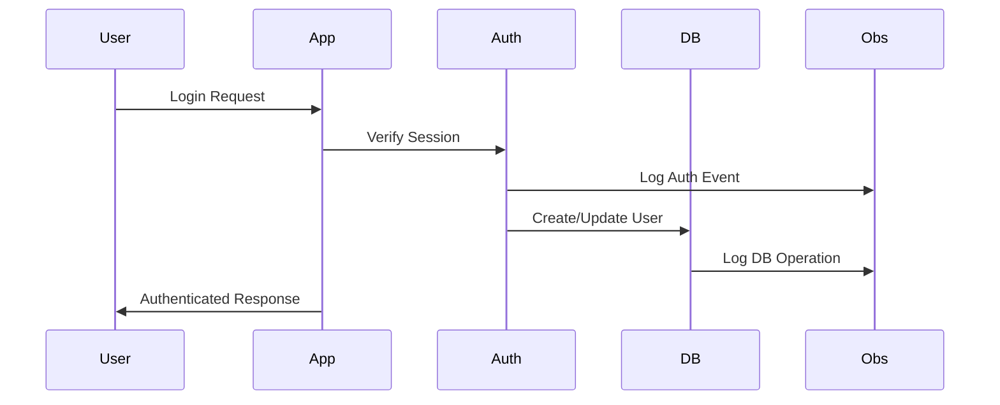
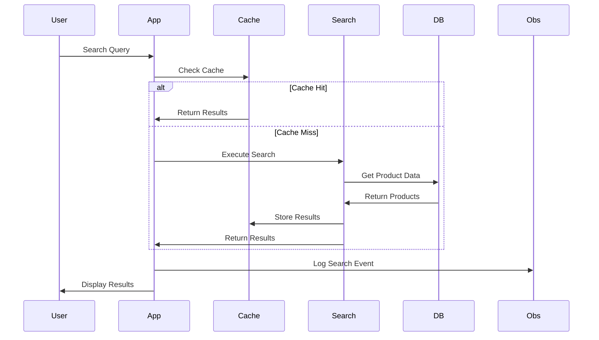
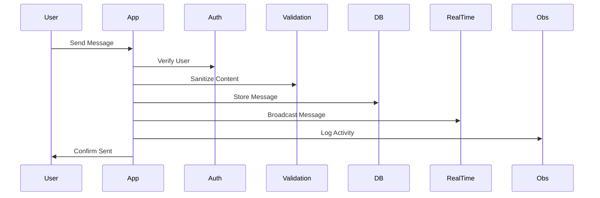

# Package Dependency Graph

This document provides a visual representation of how packages depend on each other in the Threadly marketplace monorepo.

## Dependency Graph Overview



## Package Categories

### Core Infrastructure
Essential packages that provide foundational functionality.

#### Database (`@repo/database`)
- **Purpose**: Prisma ORM client and database connection
- **Dependencies**: None (external: Prisma, Neon)
- **Dependents**: All business logic packages
- **Key Exports**: `database`, Prisma types

#### Authentication (`@repo/auth`)
- **Purpose**: Clerk authentication integration
- **Dependencies**: `@repo/observability`
- **Dependents**: All apps, messaging, notifications
- **Key Exports**: `currentUser`, auth components, middleware

#### Cache (`@repo/cache`)
- **Purpose**: Redis/Memory caching layer
- **Dependencies**: `@repo/error-handling`
- **Dependents**: Search, commerce, messaging
- **Key Exports**: `getCacheService`, cache strategies

#### Observability (`@repo/observability`)
- **Purpose**: Logging, monitoring, error tracking
- **Dependencies**: None (external: Sentry, Logtail)
- **Dependents**: All packages (cross-cutting)
- **Key Exports**: `log`, `logError`, monitoring utils

### Business Logic Packages

#### Commerce (`@repo/commerce`)

- **Dependencies**: Database, Cache, Utils, Cart
- **Purpose**: E-commerce business logic
- **Key Features**: Product management, cart operations, checkout flow

#### Search (`@repo/search`)

- **Dependencies**: Database, Cache, Observability
- **Purpose**: Product search and indexing
- **Key Features**: Algolia integration, caching, analytics

#### Messaging (`@repo/messaging`)

- **Dependencies**: Database, Validation, Observability, Real-time
- **Purpose**: User-to-user messaging system
- **Key Features**: Conversations, real-time messaging, notifications

### Cross-Cutting Concerns

#### Security (`@repo/security`)

- **Purpose**: Security middleware and utilities
- **Integration Points**: All API endpoints, middleware
- **Key Features**: Rate limiting, CSRF protection, input sanitization

#### Validation (`@repo/validation`)

- **Purpose**: Input validation and sanitization
- **Key Features**: Zod schemas, DOMPurify integration, security middleware

## Dependency Analysis by Application

### Web App Dependencies
```typescript
// apps/web/package.json dependencies
"@repo/analytics": "workspace:*",
"@repo/auth": "workspace:*",
"@repo/cache": "workspace:*",
"@repo/cart": "workspace:*",
"@repo/cms": "workspace:*",
"@repo/commerce": "workspace:*",
"@repo/database": "workspace:*",
"@repo/design-system": "workspace:*",
"@repo/email": "workspace:*",
"@repo/error-handling": "workspace:*",
"@repo/feature-flags": "workspace:*",
"@repo/internationalization": "workspace:*",
"@repo/next-config": "workspace:*",
"@repo/observability": "workspace:*",
"@repo/payments": "workspace:*",
"@repo/rate-limit": "workspace:*",
"@repo/search": "workspace:*",
"@repo/security": "workspace:*",
"@repo/seo": "workspace:*",
"@repo/utils": "workspace:*"
```

### Dashboard App Dependencies  
```typescript
// apps/app/package.json dependencies
"@repo/analytics": "workspace:*",
"@repo/auth": "workspace:*",
"@repo/cache": "workspace:*",
"@repo/cart": "workspace:*",
"@repo/commerce": "workspace:*",
"@repo/utils": "workspace:*",
"@repo/collaboration": "workspace:*",
"@repo/database": "workspace:*",
"@repo/design-system": "workspace:*",
"@repo/email": "workspace:*",
"@repo/error-handling": "workspace:*",
"@repo/feature-flags": "workspace:*",
"@repo/internationalization": "workspace:*",
"@repo/next-config": "workspace:*",
"@repo/notifications": "workspace:*",
"@repo/observability": "workspace:*",
"@repo/payments": "workspace:*",
"@repo/real-time": "workspace:*",
"@repo/search": "workspace:*",
"@repo/security": "workspace:*",
"@repo/seo": "workspace:*",
"@repo/storage": "workspace:*",
"@repo/validation": "workspace:*",
"@repo/webhooks": "workspace:*"
```

### API Service Dependencies
```typescript
// apps/api/package.json dependencies  
"@repo/analytics": "workspace:*",
"@repo/auth": "workspace:*",
"@repo/cache": "workspace:*",
"@repo/database": "workspace:*",
"@repo/design-system": "workspace:*",
"@repo/next-config": "workspace:*",
"@repo/observability": "workspace:*",
"@repo/payments": "workspace:*",
"@repo/search": "workspace:*",
"@repo/security": "workspace:*",
"@repo/testing": "workspace:*",
"@repo/validation": "workspace:*"
```

## Critical Dependency Paths

### User Authentication Flow


### Product Search Flow


### Message Send Flow


## Package Export Patterns

### Standard Export Structure
```typescript
// package.json exports
{
  "exports": {
    ".": "./index.ts",           // Main exports
    "./server": "./server.ts",   // Server-only utilities
    "./client": "./client.tsx",  // Client-side components
    "./keys": "./keys.ts"        // Environment configuration
  }
}
```

### Import Patterns
```typescript
// ✅ Correct - Package root imports
import { Button } from '@repo/design-system';
import { database } from '@repo/database';
import { currentUser } from '@repo/auth/server';

// ❌ Wrong - Deep imports
import { Button } from '@repo/design-system/components/ui/button';
import { PrismaClient } from '@repo/database/node_modules/@prisma/client';
```

## Circular Dependency Prevention

### Rules
1. **Core packages** cannot depend on business logic packages
2. **Business logic packages** can depend on core packages
3. **UI packages** (design-system) have minimal dependencies
4. **Apps** can depend on any package but not vice versa

### Dependency Layers
```
Layer 4: Applications (web, app, api)
    ↓
Layer 3: Business Logic (commerce, search, messaging)
    ↓
Layer 2: Core Services (auth, database, cache)
    ↓
Layer 1: Utilities (utils, validation, design-system)
```

## Performance Considerations

### Bundle Impact Analysis
```
Core Packages (always loaded):
- @repo/auth: ~50KB
- @repo/database: ~200KB (server-only)
- @repo/design-system: ~100KB
- @repo/observability: ~75KB

Business Logic (conditionally loaded):
- @repo/commerce: ~80KB
- @repo/search: ~60KB
- @repo/messaging: ~45KB
```

### Code Splitting Strategy
- Core packages: Included in main bundle
- Business logic: Dynamic imports where possible
- UI components: Lazy loading for heavy components

## Dependency Health Monitoring

### Key Metrics
1. **Bundle Size Impact**: Track size changes per package
2. **Build Performance**: Monitor build times per package
3. **Runtime Performance**: Track integration points latency
4. **Dependency Freshness**: Monitor for outdated dependencies

### Health Checks
```typescript
// Regular dependency health checks
const healthChecks = {
  database: () => database.$queryRaw`SELECT 1`,
  cache: () => cache.ping(),
  search: () => searchService.healthCheck(),
  auth: () => verifyAuthConfiguration()
};
```

## Migration Strategies

### Adding New Dependencies
1. Evaluate necessity and alternatives
2. Update package.json with workspace:* version
3. Update this documentation
4. Add to relevant health checks
5. Consider bundle size impact

### Removing Dependencies
1. Verify no usage with comprehensive search
2. Remove from package.json
3. Update integration documentation
4. Test all affected apps
5. Monitor for runtime errors

### Dependency Upgrades
1. Test in isolation first
2. Check breaking changes across integration points
3. Update integration patterns if needed
4. Coordinate across all consuming packages